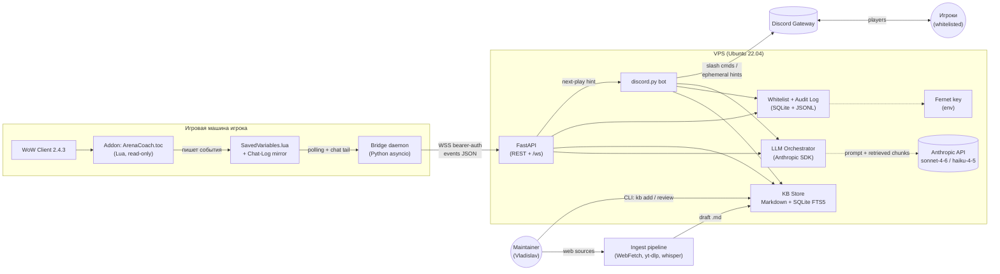

# Arena Coach — Phase 0 Design

**Статус:** draft, ждёт approve от владельца перед стартом Phase 1
**Автор:** Arena Coach Dev (Cowork-агент)
**Дата:** 2026-05-12
**Версия:** 0.1

---

## 0. Краткое резюме решений

| Слой | Выбор | Обоснование |
|------|-------|-------------|
| Backend язык | Python 3.11+ | Anthropic SDK first-class, discord.py зрелый, OCR/CV готов для Phase 5. |
| HTTP/WSS | FastAPI + `websockets` | Async, валидация через pydantic, OpenAPI бесплатно. |
| Discord | `discord.py` 2.x | Slash-команды, ephemeral, permissions API. |
| Бот scope | Single-guild | По ответу владельца. Whitelist глобальный. |
| БД | SQLite + FTS5 + `sqlite-vec` (later) | Один VPS, низкий трафик, легко бэкапить. PostgreSQL — апгрейд если понадобится. |
| ORM | SQLAlchemy 2 + Alembic | Type hints, миграции. |
| KB-формат | Markdown + YAML frontmatter | Источник правды на диске + git history; индекс в SQLite. |
| Шифрование whitelist | `cryptography.fernet` | Простой симметричный, ключ в `.env`. |
| Lua addon | Pure WoW 2.4.3 API | Без LibStub в v1, минимизируем зависимости. |
| Bridge → backend | WSS + bearer token | Один долгоживущий коннект, low latency. |
| Hosting backend | Hetzner/DO VPS, Ubuntu 22.04, systemd | Дёшево, 24/7. |
| LLM | Anthropic `claude-sonnet-4-6` (hint synth), `claude-haiku-4-5` (classify) | Согласно sys-prompt. |
| CI | GitHub Actions: `ruff`, `mypy --strict`, `pytest` | Стандарт. |

---

## 1. Архитектурная диаграмма



**Что важно в этой картинке:**

- Стрелки от `WoW` к внешнему миру идут **только через файловую систему** (SavedVariables + Chat-Log). Никакого input injection, никакой записи в игру — это закреплено архитектурой, не только policy.
- Bridge — единственный компонент, имеющий прямой доступ к диску клиента. Backend бриджа не видит.
- Whitelist стоит перед каждой точкой входа: Discord-команды, WSS-эндпоинт bridge'а, CLI KB-админки.
- KB-store — один источник правды. Bot и Orchestrator читают только из него; никакой матчап-логики в коде.

---

## 2. Структура репозитория

```
arena-coach/
├── README.md
├── LICENSE
├── .env.example
├── .gitignore                    # *.token, .env, SavedVariables*.lua, *.db
├── pyproject.toml                # ruff, mypy --strict, pytest config
├── .pre-commit-config.yaml
├── .github/
│   └── workflows/
│       ├── ci.yml                # ruff + mypy + pytest на PR
│       └── deploy.yml            # rsync на VPS (manual trigger)
│
├── addon/                        # WoW Lua addon
│   ├── ArenaCoach.toc            # ## Interface: 20400
│   ├── ArenaCoach.lua            # bootstrap + frame
│   ├── core/
│   │   ├── EventBus.lua
│   │   ├── ArenaTracker.lua      # ARENA_OPPONENT_UPDATE, UNIT_AURA
│   │   ├── CombatLog.lua         # COMBAT_LOG_EVENT_UNFILTERED
│   │   ├── CooldownTracker.lua   # трикеты, эвейжн, prep, vanish, ice-block...
│   │   └── Serializer.lua        # запись в ArenaCoachDB
│   ├── ui/
│   │   └── StatusFrame.lua       # маленький "connected/idle" frame
│   └── README.md                 # как ставить, какие SV пишутся
│
├── bridge/                       # local Python daemon
│   ├── pyproject.toml
│   ├── arena_bridge/
│   │   ├── __main__.py
│   │   ├── config.py             # env, paths, account/realm autodetect
│   │   ├── sv_tail.py            # polling SavedVariables.lua
│   │   ├── chat_tail.py          # Logs/Chat-*.txt tail (realtime канал)
│   │   ├── normalizer.py         # raw event → canonical schema
│   │   └── ws_client.py          # WSS → backend
│   ├── tests/
│   └── README.md
│
├── backend/                      # VPS-resident
│   ├── pyproject.toml
│   ├── arena_coach/
│   │   ├── __main__.py
│   │   ├── api/                  # FastAPI app
│   │   │   ├── app.py
│   │   │   ├── routes/
│   │   │   │   ├── ws.py         # /ws/bridge — приём событий
│   │   │   │   ├── kb.py         # GET /kb/matchups/{slug}
│   │   │   │   ├── whitelist.py  # admin REST (бэк для CLI/Discord)
│   │   │   │   └── health.py
│   │   │   └── deps.py
│   │   ├── bot/                  # discord.py
│   │   │   ├── client.py
│   │   │   ├── cogs/
│   │   │   │   ├── matchup.py
│   │   │   │   ├── glossary.py
│   │   │   │   ├── access.py     # admin: whitelist
│   │   │   │   └── coach.py      # /coach pause, /coach resume
│   │   │   └── checks.py         # @whitelist_required, @role_required
│   │   ├── kb/
│   │   │   ├── loader.py         # MD → pydantic model
│   │   │   ├── indexer.py        # FTS5 + (later) vector
│   │   │   ├── retriever.py      # query → ranked chunks
│   │   │   └── schema.py         # pydantic модели KBDoc, Section, Source
│   │   ├── orchestrator/
│   │   │   ├── client.py         # Anthropic SDK wrapper
│   │   │   ├── prompts/          # системные промпты для hint synth, classify
│   │   │   └── pipeline.py       # event → matchup → retrieve → synth → reply
│   │   ├── access/
│   │   │   ├── models.py         # SQLAlchemy: WhitelistEntry, AuditEntry
│   │   │   ├── service.py        # add/remove/check
│   │   │   ├── crypto.py         # Fernet wrappers
│   │   │   └── audit.py          # append-only JSONL writer
│   │   └── shared/
│   │       ├── logging.py
│   │       └── settings.py       # pydantic-settings
│   ├── alembic/                  # миграции
│   ├── tests/
│   │   ├── unit/
│   │   ├── integration/
│   │   └── fixtures/
│   └── README.md
│
├── kb/                           # Source of truth, version-controlled
│   ├── matchups/
│   │   ├── rm-vs-warrior-rdruid.md
│   │   └── ...
│   ├── glossary/
│   │   ├── abilities.json        # spell_id, dr_category, duration
│   │   └── terms.md              # premed / shatter / blanket / sap-stall...
│   ├── compositions.json         # canonical comp slugs
│   ├── drafts/                   # ingest output, ждёт review
│   └── README.md                 # как добавлять матчап
│
├── ingest/                       # CLI-импортёры (sources → drafts/)
│   ├── pyproject.toml
│   ├── arena_ingest/
│   │   ├── __main__.py           # `kb add --from mirlol|tbcpvp|youtube|paste`
│   │   ├── sources/
│   │   │   ├── mirlol.py         # WebFetch + parser
│   │   │   ├── tbcpvp.py
│   │   │   ├── youtube.py        # yt-dlp + whisper + LLM normalize
│   │   │   └── paste.py
│   │   └── llm_normalize.py
│   └── README.md
│
├── docs/                         # design + ops
│   ├── architecture.md
│   ├── phase-0-design.md         # ← этот файл
│   ├── kb-schema.md
│   ├── events-schema.md
│   ├── deployment.md
│   ├── tos-risk-assessment.md    # Phase 5 prep
│   └── decisions/                # ADR (Architecture Decision Records)
│       ├── 0001-python-stack.md
│       ├── 0002-sqlite-vs-pg.md
│       └── 0003-chatframe-realtime-channel.md
│
└── ops/
    ├── systemd/
    │   ├── arena-coach-api.service
    │   └── arena-coach-bot.service
    ├── caddy/Caddyfile
    └── scripts/
        ├── deploy.sh
        ├── backup_db.sh
        └── rotate_audit_log.sh
```

**Принципы:**

- 4 deployable артефакта: `addon` (на игровой PC), `bridge` (на игровой PC), `backend` (VPS), `ingest` (CLI на dev-машине). Каждый со своим `pyproject.toml`, чтобы зависимости не текли.
- `kb/` — отдельная корневая папка, потому что это **контент**, не код. Можно вынести в отдельный private repo и подцепить submodule'ом, если нужно.
- `docs/decisions/` — ADR-формат для важных решений: что/почему/альтернативы/последствия. Помогает не переоткрывать дискуссии.

---

## 3. Схема KB-документа

### 3.1 Frontmatter (YAML)

Полная схема со всеми полями, валидируется pydantic-моделью `KBDoc`:

```yaml
---
# --- идентификация ---
slug: rm-vs-warrior-rdruid              # kebab-case, уникален
schema_version: 1                        # для будущих миграций
expansion: tbc                           # tbc | wotlk (на будущее)

# --- что vs что ---
composition: rogue+mage                  # наш состав, canonical slug
vs: warrior+resto-druid                  # противник, canonical slug
bracket: 2v2                             # 2v2 | 3v3 | 5v5

# --- классификация ---
difficulty: easy                         # easy | moderate | hard | very-hard | mirror
kill_target:                             # primary / fallback
  primary: druid
  fallback: warrior
win_condition: "fast druid swap on opener, control warrior with sap-stall"

# --- по картам (если есть нюансы) ---
maps_notes:
  nagrand: "use central pillars to LOS warrior intercept"
  lordaeron: "open near box pillar for vanish setup"
  blade_edge: "avoid bridge if druid pre-hots"

# --- источники (обязательно ≥1) ---
sources:
  - { type: web, url: "https://mirlol.pro/rm-vs-wd", retrieved: 2026-05-12 }
  - { type: youtube, url: "https://youtu.be/xxxxx", t: "12:34", title: "Mirlol 2v2 RM" }
  - { type: stream-paste, author: "<streamer-nick>", platform: twitch, date: 2026-04-15 }

# --- governance ---
last_reviewed: 2026-05-12
reviewer: "<discord-id>"                 # кто одобрил draft → main
confidence: high                         # high | medium | low | draft
tags: [opener-burst, sap-stall, druid-swap]
---
```

### 3.2 Секции тела (Markdown)

Фиксированный порядок и якоря — это позволяет deterministic-рендер в Discord embed без LLM:

```markdown
## Opener
[2-5 предложений]. Inline-ссылки на способности: [[ability:cheap-shot]] на хила,
[[ability:counterspell]] на дамаг противника, [[ability:blind]] на пик-помощь.

## Alternative opener
[если первый не проходит — например, противник в пилларах]

## If enemy trinkets
[что делаем по дамагеру / по хилу после CC-trinket]

## Mid-fight rotation
[как держим давление до 2-го трикета / 2-го vanish]

## Endgame / OOM scenarios
[мана-вар на маге, druid-OOM, dampening]

## Common mistakes
- ошибка 1
- ошибка 2

## Key cooldowns to track
### Enemy
- trinket (2 мин)
- intercept (30 сек)
- spell-reflect (10 сек)
- ...

### Ours
- evasion / cloak / vanish / prep
- counterspell / blink / ice-block
- ...

## Notes
[любая свободная форма, опционально]
```

**Парсер `kb/loader.py`:**
- YAML frontmatter → pydantic `KBDoc.meta`
- Каждая `## H2` → `Section(title, body_md)`
- Inline `[[ability:slug]]` → резолвится через `kb/glossary/abilities.json`
- Если секция отсутствует — это OK (опционально), но `Opener` и `sources` — обязательны.

### 3.3 Глоссарий способностей

`kb/glossary/abilities.json`:

```json
{
  "cheap-shot": {
    "spell_id": 1833,
    "en_name": "Cheap Shot",
    "ru_name": "Внезапный удар",
    "class": "rogue",
    "icon": "Ability_CheapShot",
    "duration": 4,
    "dr_category": "incapacitate",
    "school": "physical"
  },
  "kidney-shot": {
    "spell_id": 8643,
    "en_name": "Kidney Shot",
    "ru_name": "Удар по почкам",
    "class": "rogue",
    "duration": 6,
    "dr_category": "stun",
    "school": "physical"
  },
  "counterspell": {
    "spell_id": 2139,
    "en_name": "Counterspell",
    "ru_name": "Контрзаклинание",
    "class": "mage",
    "duration": 8,
    "dr_category": "silence",
    "school": "arcane"
  }
}
```

Этот файл — общий справочник для:
- Lua addon (резолвит spell_id ↔ ability slug в реальном времени),
- KB-loader (валидирует, что `[[ability:slug]]` существует),
- Discord embed (рендерит читаемое имя + EN/RU tooltip).

### 3.4 Пример заполненного матчапа — **из реального Mirlol-гайда**

> Транскрибировано дословно из `WOW TBC ARENA - Rogue  Mage.md`, секция `vs Warrior/Resto Druid` (строки 11-31). Это **реальный текст, не синтетика**, поэтому `confidence: high` и source указывает на ваш файл. Перевод на русский в Phase 1 — отдельным проходом через LLM-нормализатор с human review.

```markdown
---
slug: rm-vs-warrior-rdruid
schema_version: 1
expansion: tbc
composition: rogue+mage
vs: warrior+resto-druid
bracket: 2v2
difficulty: easy
kill_target:
  primary: druid
  fallback: warrior
win_condition: "Rogue trains druid with mage shatter support; warrior gets sheep-locked. Reset on warrior trinket if pressure on druid not yet developed."
maps_notes: {}    # карта-специфичных пометок в исходном тексте нет
sources:
  - { type: file, path: "WOW TBC ARENA - Rogue  Mage.md", lines: "11-31",
      author: "Mirlol (transcribed)", retrieved: 2026-05-12 }
last_reviewed: 2026-05-12
reviewer: "<TBD: Vladislav>"
confidence: high
tags: [opener-burst, druid-swap, double-wound, evasion-preempt]
---

## Opener
Если друид в stealth, рог ищет друида, а маг кайтит варриора rank-1 спеллами,
фишинг на clearcast и frostbite proc'и для slow-урона. Если друид в tree form —
маг сначала sheep'ит варриора, потом рог открывает на друида. Если варр **не gnome**,
можно открывать с [[ability:frost-nova]] на варриоре, при условии, что sheep успевает
лечь до spell-reflect или fear.

Equip: double wound. Combo: [[ability:cheap-shot]] → [[ability:shiv]] →
[[ability:gouge]] чтобы стол-аутить HOT'ы, маг шатерит друида ровно когда
[[ability:kidney-shot]] лэндит после gouge. Если рог в радиусе варра — **pop
[[ability:evasion]] превентивно**, чтобы варр не трикетнул в hamstring/mace-stun proc.

## If enemy trinkets
Когда варр трикетит: либо resheep, либо nova по варру; если позиционно неудобно или
маг под fear/intercept/pummel — рог [[ability:blind]] варра и продолжает tunneling друида.

[[ability:counterspell]] после kidney по друиду — закрывает мага от faerie fire и
блокирует hot-spell-школу.

## Mid-fight rotation
Если друид low HP к этому моменту: [[ability:vanish]] → [[ability:premed]] →
[[ability:garrote]] → [[ability:eviscerate]] (или [[ability:expose-armor]] если друид
ещё healthy) и продолжаем давление, маг слоит варра rank-1 cone of cold / blizzard.

## Reset option
Опционально для safe-плея: на trinket варра можно ресет — LoS faerie fire, restealth
или [[ability:vanish]] и подождать DR-окно. Затем повторить тот же opener с нуля.
Делается когда pressure на друиде ещё не разогналась.

## Notes
Маг обычно сам выживает против варра 1v1 пока рог держит дистанцию и не получает
faerie fire или мили-удары.

## Key cooldowns to track
### Enemy
- warrior: trinket (2m), intercept (30s), spell-reflect (10s), mace-stun proc, hamstring
- druid: trinket (2m), faerie fire, HOT-rotation, tree-form pre-hots, escape artist (если gnome — N/A)

### Ours
- rogue: evasion (preempt), cloak, vanish, preparation, blind, kidney, shiv
- mage: ice-block, blink, counterspell, frost-nova, polymorph (sheep)

## Equipment
- main hand: wound poison
- off hand: wound poison (double wound)
- swap: crippling в OH ситуативно (mirror и vs хил-меле)
```

**Что особенного в этом примере по сравнению с синтетикой:**

- Тактические утверждения дословно из источника. Никакого «60-70% HP» из головы — таких чисел в Mirlol-тексте нет.
- Есть нюансы, которые я не заложил бы сам: «evasion **preempt**» (не реактивно), «sheep только если warr не gnome», «cone of cold / blizzard rank-1 для slow». Это причина, по которой KB — единственный источник правды.
- `sources.path` указывает на конкретный файл и строки 11-31; reviewer (вы) подтверждает перенос.
- Карта-специфичные заметки пусты, потому что в источнике их нет — не выдумываем.

### 3.5 Inventory: что уже есть в твоих файлах

После сканирования двух Mirlol-документов:

**`WOW TBC ARENA - Rogue  Mage.md` (RM, 12 матчапов):**

| # | Враги | Difficulty | Kill target (hint) |
|---|-------|-----------|---------------------|
| 1 | Warrior / Resto Druid | easy | druid |
| 2 | Rogue / Mage (mirror) | mirror | rogue |
| 3 | Rogue / Rogue | very-hard | stealth game |
| 4 | Warlock / Priest | hard | priest (2 опции) |
| 5 | Rogue / Priest | easy | priest или rogue (выбор) |
| 6 | Rogue / Resto Druid | hard | druid (или rogue если открыли первыми) |
| 7 | Hunter / Resto Druid | easy | druid → hunter |
| 8 | Warrior / Resto Shaman | easy | shaman |
| 9 | Ret Paladin / Resto Shaman | hard | paladin (через trinket/bubble) |
| 10 | Warlock / Resto Druid | hard | druid |
| 11 | Mage / Priest | moderate | priest (S1-S2), mage опционально S3-S4 |
| 12 | Warlock / Rogue | moderate | warlock или rogue (зависит от HP) |

**`WOW TBC ARENA - Rogue Priest.md` (RP, 10 матчапов):**

| # | Враги | Difficulty |
|---|-------|-----------|
| 1 | Warrior / Resto Druid | moderate |
| 2 | Rogue / Mage | hard |
| 3 | Rogue / Priest (mirror) | mirror |
| 4 | Rogue / Rogue | very-hard |
| 5 | Hunter / Resto Druid | hard |
| 6 | Mage / Priest | moderate |
| 7 | Warlock / Priest | easy |
| 8 | Rogue / Resto Druid | moderate |
| 9 | Warlock / Resto Druid | moderate |
| 10 | Ret Paladin / Resto Shaman | very-hard |

**Итого: 22 KB-документа в первом сидинге.** Все приходят как `kb/drafts/*.md`; ваш review апрувит partition'ами (например, по 4-5 за раз).

**Структурное наблюдение для парсера:**
- Сепаратор матчапа: строка `vs` + следующая non-empty строка = comp противника, ещё через строку = difficulty (`Easy|Moderate|Hard|Very Hard|Mirror`), затем строка с class-icon (`` — это «канонический kill-target hint»), затем секции `### …`.
- Секции варьируются по матчапам: `### Opener` / `### Strategy` / `### Stealth Game` / `### General` / `### Mid-Game` / `### Win Conditions` / `### Things to Watch Out For` / `### If They Open on You` / `### Alternative Openers` / `### Plan B — …` / `### Opening on the Mage` / `### Pet Goes & Pillar Play`.
- Inline-способности форматом `<name>` — детерминированно резолвимо в `[[ability:<slug>]]` через mapping `<icon>.jpg → ability-slug`.
- Difficulty-значения нормализуются 1-в-1 в frontmatter (`easy|moderate|hard|very-hard|mirror`).
- Class-icon в первой строке после difficulty → `kill_target.primary` (heuristic, всегда требует human подтверждения).

---

## 4. Discord-команды и моки embed'ов

### 4.1 Перечень команд (Phase 2)

| Команда | Параметры | Роль | Ephemeral? | Описание |
|---------|-----------|------|------------|----------|
| `/matchup` | `our`, `vs`, `bracket?` | viewer+ | yes | Полный embed: opener / alt / post-trinket / mistakes / CDs. |
| `/opener` | `our`, `vs`, `bracket?` | viewer+ | yes | Только секция Opener — компактно, для быстрого reread. |
| `/glossary` | `term` | viewer+ | yes | Расшифровка термина (DR, premed, shatter, sap-stall, blanket CS). |
| `/list_comps` | — | viewer+ | yes | Все составы, по которым есть KB. |
| `/source` | `slug` | viewer+ | yes | Список источников для матчапа со ссылками. |
| `/coach pause` | `minutes?` | player+ | yes | Заглушить real-time подсказки (Phase 4). |
| `/coach resume` | — | player+ | yes | Возобновить подсказки. |
| `/access add` | `user`, `role`, `character`, `realm` | admin | yes | Добавить в whitelist. |
| `/access remove` | `user` | admin | yes | Удалить из whitelist. |
| `/access list` | `role?` | admin | yes | Текущий whitelist. |
| `/access audit` | `user?`, `days?` | admin | yes | Срез audit log (последние N дней или конкретный actor). |
| `/access link` | `character`, `realm` | viewer+ | yes | Привязать свой Discord ID к WoW-персонажу (требует admin-approve). |

**Whitelist policy:**
- Все команды кроме `/glossary` и `/list_comps` требуют **активный whitelist-эвент**. Сами `/glossary` и `/list_comps` тоже требуют — default-deny **везде**, без исключений.
- Отказ от whitelist-проверки = единый ephemeral ответ: «У тебя нет доступа. Напиши владельцу <@owner_id>».
- Admin-команды дополнительно требуют роль `admin`.

### 4.2 Mock: `/matchup our:rogue+mage vs:warrior+resto-druid`

```
┌────────────────────────────────────────────────────────────────┐
│ ⚔️  RM vs Warrior / Resto-Druid  •  2v2  •  difficulty: easy   │
├────────────────────────────────────────────────────────────────┤
│ Kill target: druid (primary)  •  fallback: warrior             │
│ Win condition: fast druid swap, sap-stall warrior              │
│                                                                │
│ 📖  Opener                                                     │
│ Маг открывает Polymorph на варриоре. Рог сапает и идёт         │
│ на друида: Cheap Shot → Kidney Shot. Маг свопает: Frostbolt    │
│ + shatter (Frost Nova → Ice Lance). Цель — 60-70% HP с друида  │
│ до первого трикета.                                            │
│                                                                │
│ 🔄  If enemy trinkets                                          │
│ Druid → kidney: garrote-silence + повторный stun.              │
│ Druid → sheep варра: swap pressure, blind на warr.             │
│                                                                │
│ ❌  Common mistakes                                            │
│ • Маг открывает frostbolt до сапа на друиде                    │
│ • Рог vanish'ит на первый трикет, теряя prep                   │
│                                                                │
│ ⏱  CDs to track                                                │
│ Enemy:   trinket 2m • intercept 30s • spell-reflect 10s        │
│ Ours:    evasion • cloak • vanish • prep • blind • ice-block   │
│                                                                │
│ 🗺  Maps                                                       │
│ Nagrand: open behind center pillar (LOS intercept)             │
│ Lordaeron: open from box, pyro setup from corner               │
│                                                                │
├────────────────────────────────────────────────────────────────┤
│ 📚  Sources: /source rm-vs-warrior-rdruid                      │
│ 🔍  Glossary: /glossary <term>                                 │
│ Last reviewed: 2026-05-12 by @Vladislav  •  confidence: high   │
└────────────────────────────────────────────────────────────────┘
        Footer: "KB doc rm-vs-warrior-rdruid  •  schema v1"
```

### 4.3 Mock: `/opener` (компактный, для in-game pre-game чека)

```
┌────────────────────────────────────────────────────────────────┐
│ ⚡  Opener — RM vs Warrior / Druid                             │
├────────────────────────────────────────────────────────────────┤
│ 1. Mage: Polymorph → warrior                                   │
│ 2. Rogue: Sap → druid → Cheap Shot → Kidney Shot               │
│ 3. Mage: swap → Frostbolt + Shatter (Nova → Ice Lance)         │
│                                                                │
│ Goal: ~60-70% off druid before first trinket                   │
└────────────────────────────────────────────────────────────────┘
```

### 4.4 Mock: `/glossary term:blanket-cs`

```
┌────────────────────────────────────────────────────────────────┐
│ 📚  blanket CS (blanket counterspell)                          │
├────────────────────────────────────────────────────────────────┤
│ Counterspell, забрасываемый «вслепую» — не реактивно на каст,  │
│ а превентивно, чтобы залочить школу заклинаний цели на 8 сек.  │
│ Применяется против хилов (lock holy/nature) и против шейп-кастов│
│ друида (innervate, cyclone).                                   │
│                                                                │
│ Связано с: silence-DR, premed, kick-rotation                   │
└────────────────────────────────────────────────────────────────┘
```

### 4.5 Mock: `/access audit days:7`

```
┌────────────────────────────────────────────────────────────────┐
│ 🔒  Audit log — last 7 days  (12 entries)                      │
├────────────────────────────────────────────────────────────────┤
│ 2026-05-12 18:42  @Vladislav  whitelist.add                    │
│   → target=@Friend1 role=player char=Ragestab-Lordaeron        │
│                                                                │
│ 2026-05-12 17:10  @Vladislav  coach.pause   minutes=30         │
│                                                                │
│ 2026-05-11 22:03  @Friend1    matchup.query                    │
│   → our=rogue+mage vs=warrior+resto-druid  result=hit          │
│                                                                │
│ 2026-05-11 21:55  unknown_user  matchup.query  result=denied   │
│   → reason=not_in_whitelist  user_id=8392…                     │
│                                                                │
│ ... (8 more)                                                   │
├────────────────────────────────────────────────────────────────┤
│ Full log path: /var/lib/arena-coach/audit-2026-05.jsonl        │
│ Total entries today: 47                                        │
└────────────────────────────────────────────────────────────────┘
```

### 4.6 Mock: ответ «нет доступа»

```
┌────────────────────────────────────────────────────────────────┐
│ 🚫  Access denied                                              │
│                                                                │
│ У тебя нет доступа к Arena Coach. Запросить можно у владельца: │
│ <@<owner_discord_id>>.                                         │
│                                                                │
│ Что нужно от тебя для добавления:                              │
│   • имя WoW-персонажа                                          │
│   • realm                                                      │
│   • основной состав (например, rogue+mage)                     │
└────────────────────────────────────────────────────────────────┘
```

### 4.7 Mock: real-time hint (Phase 4, ephemeral DM)

```
┌────────────────────────────────────────────────────────────────┐
│ 🎯  Live hint — RM vs Warrior/Druid                            │
├────────────────────────────────────────────────────────────────┤
│ Druid just trinketed Kidney Shot.                              │
│                                                                │
│ Next play (from KB):                                           │
│ → garrote-silence на друиде                                    │
│ → готовь повторный kidney через combo-points                   │
│ → маг продолжает sheep-rotation на варре                       │
│                                                                │
│ Watch: druid trinket теперь 2:00 down.                         │
├────────────────────────────────────────────────────────────────┤
│ Source: rm-vs-warrior-rdruid §If enemy trinkets                │
│ /coach pause — заглушить на матч                               │
└────────────────────────────────────────────────────────────────┘
```

---

## 5. Whitelist — структура, хранение, шифрование

### 5.1 Таблица `whitelist_entries`

```python
class WhitelistEntry(Base):
    __tablename__ = "whitelist_entries"

    id: Mapped[int] = mapped_column(primary_key=True)
    discord_id: Mapped[str] = mapped_column(String(32), unique=True, index=True)
    discord_handle: Mapped[str] = mapped_column(String(64))      # @display, для UI
    wow_character_enc: Mapped[bytes]                              # Fernet-encrypted
    wow_realm_enc: Mapped[bytes]                                  # Fernet-encrypted
    role: Mapped[Role] = mapped_column(Enum(Role))                # viewer/player/admin
    added_by: Mapped[str] = mapped_column(String(32))             # discord_id of admin
    added_at: Mapped[datetime] = mapped_column(default=utcnow)
    expires_at: Mapped[datetime | None] = mapped_column(nullable=True)
    is_active: Mapped[bool] = mapped_column(default=True)
    notes: Mapped[str | None] = mapped_column(Text, nullable=True)
```

**Что шифруется:**
- `wow_character`, `wow_realm` — Fernet-encrypted в БД. Утечка дампа БД не раскрывает игровые ники.
- `discord_id`/`discord_handle` — открытыми (это публичная инфа в гильд-сервере), но всё равно `.gitignore`'ятся.

**Ключ шифрования:**
- 32 байта Fernet-key, хранится в `.env` как `ARENA_COACH_FERNET_KEY=...`.
- Ротация: новый ключ + миграционный скрипт, прокатывающий перешифровку батчами под транзакцией. Старый ключ держится 30 дней для rollback (multi-key Fernet).
- Backup БД шифруется отдельным ключом перед загрузкой на удалённое хранилище.

### 5.2 Роли и права

| Роль | KB read | Real-time hints | Whitelist mutate | Audit access |
|------|---------|-----------------|------------------|--------------|
| `viewer` | ✅ | ❌ | ❌ | ❌ |
| `player` | ✅ | ✅ | ❌ | ❌ |
| `admin` | ✅ | ✅ | ✅ | ✅ |

Owner (вы) — отдельный «суперроль» в `.env`: `ARENA_COACH_OWNER_DISCORD_IDS=...`. Owner всегда admin, не может быть удалён whitelist-командой.

### 5.3 Audit log — append-only JSONL

Файл: `/var/lib/arena-coach/audit-YYYY-MM.jsonl`, ротация помесячно (cron).

Формат одной строки:

```json
{
  "ts": "2026-05-12T18:42:11.342Z",
  "actor": {"discord_id": "1234...", "handle": "Vladislav"},
  "action": "whitelist.add",
  "target": {"discord_id": "5678...", "handle": "Friend1"},
  "payload_hash": "sha256:ab12...",
  "payload_redacted": {
    "role": "player",
    "character_hint": "Rag***ab",
    "realm_hint": "Lor***on"
  },
  "result": "success",
  "request_id": "req_01HX...",
  "source": "discord_slash"
}
```

**Правила:**
- Append-only. Никаких UPDATE/DELETE. Если запись надо «отозвать» — пишем компенсирующий event.
- `payload_hash` — SHA-256 от full payload (включая зашифрованные поля); даёт неотвергаемость без раскрытия PII.
- `payload_redacted` — частично замаскированные значения для глаз-проверки в Discord-embed.
- Файл pre-allocated с `chmod 600`, владелец — service-user.
- Лог пишется до того, как mutate-операция исполняется (write-ahead). Если операция упала — пишем второй event `action.failed` с error.

**Какие действия логируются обязательно:**
- Все `whitelist.*` (add/remove/role-change).
- Все denied-обращения (важно для детекта abuse).
- `coach.pause` / `coach.resume`.
- `kb.write` / `kb.review` (Phase 1, через CLI или Discord).
- WSS-сессии bridge: connect / disconnect / auth-fail.

---

## 6. Схема событий: addon → bridge → backend

### 6.1 Lua addon → SavedVariables

Структура `ArenaCoachDB` (записывается на logout и на `/reload`):

```lua
ArenaCoachDB = {
  schema = 1,
  client = { version = "2.4.3", build = "8606", locale = "ruRU" },
  player = { name = "...", realm = "..." },
  sessions = {
    {
      session_id = "uuid-string",
      started_at = 1747086000,         -- unix
      ended_at   = 1747086420,
      bracket    = "2v2",
      map        = "Nagrand",
      arena_team = "Team Name",
      teammates  = { { name="Mate1", class="MAGE", spec="frost-guess" } },
      enemies    = {
        { name="Foe1", class="WARRIOR", race="Human", faction="Alliance" },
        { name="Foe2", class="DRUID",   race="Tauren", faction="Horde" }
      },
      events = {
        { t=1747086002, ev="combat_start" },
        { t=1747086003, ev="aura_applied", src="Foe1", spell_id=1719,  -- Recklessness
          payload={ duration=15 } },
        { t=1747086004, ev="cast_success", src="Foe1", spell_id=20252 },
        { t=1747086007, ev="aura_removed", src="self", spell_id=42292,  -- PvP trinket
          payload={ reason="trinket_used" } },
        -- ...
        { t=1747086420, ev="combat_end", payload={ result="win" } }
      }
    }
    -- next session ...
  }
}
```

### 6.2 «Realtime» канал: chat-frame mirror

Поскольку TBC 2.4.3 пишет SV только на `/reload`/logout, для realtime нужен второй канал. Решение для Phase 4 (ADR-0003):

- Addon дополнительно `print()`-ит каждое значимое событие в **скрытый custom chat-frame** в формате `[AC|<base64-encoded-JSON>]`.
- Клиент WoW логирует все chat-frame'ы в `World of Warcraft/Logs/Chat-<date>.txt` если включён `/console scriptErrors 1` + `/console chatLogging 1`.
- Bridge `chat_tail.py` делает inotify/polling tail этого файла, фильтрует строки с префиксом `[AC|`, парсит JSON, шлёт по WSS.
- **Это легитимный read-only канал**: addon только пишет в свой UI-фрейм; chat-log — стандартная фича клиента, не модификация. Никакого побайтового вмешательства в процесс игры.
- Trade-off: лаг ~0.5-2 сек, ограничение на размер строки. Достаточно для post-trinket подсказок (которые сами не требуют <100ms).
- **ADR-0003 фиксирует решение и альтернативы:** (a) `/reload` macro after each match — приемлемо для post-match summary, но не для in-match hints; (b) external memory reading — отвергнуто, граница ToS; (c) chat-frame mirror — выбран как меньшее из зол. Перед Phase 4 — итоговая риск-оценка по ToS Blizzard, отдельный документ.

### 6.3 Canonical event (после нормализации в bridge)

JSON, отправляется по WSS на backend:

```json
{
  "schema_version": 1,
  "envelope": {
    "event_id": "evt_01HX7K8M9N0PQ",
    "session_id": "ses_01HX7K8M9N0PQ",
    "actor_discord_id": "1234...",
    "wow_character": "Stabby",
    "wow_realm": "Lordaeron",
    "client_ts": "2026-05-12T18:42:11.342Z",
    "bridge_ts": "2026-05-12T18:42:11.901Z"
  },
  "match": {
    "bracket": "2v2",
    "map": "nagrand",
    "team": [
      {"name": "Stabby",  "class": "rogue", "spec_guess": "combat"},
      {"name": "Burny",   "class": "mage",  "spec_guess": "frost"}
    ],
    "enemy": [
      {"name": "Choppy",  "class": "warrior", "race": "human", "faction": "alliance"},
      {"name": "Leafy",   "class": "druid",   "race": "tauren", "faction": "horde",
       "spec_guess": "resto"}
    ],
    "matchup_slug_hint": "rm-vs-warrior-rdruid"
  },
  "event": {
    "type": "enemy_trinket_used",
    "subject_name": "Leafy",
    "subject_role": "healer",
    "spell_id": 42292,
    "details": {
      "broke_aura_spell_id": 8643,
      "broke_aura_name": "Kidney Shot",
      "remaining_cooldown_estimate_s": 120
    }
  }
}
```

**Семейство event.type:**

| type | Источник | Триггер |
|------|----------|---------|
| `match_start` | arena_opponent_update | Заполнение enemy[] |
| `match_end` | UI_INFO_MESSAGE + score | Result win/loss |
| `enemy_cooldown_used` | CLEU SPELL_CAST_SUCCESS | Трикет, intercept, vanish, prep, evasion, ice-block, divine-shield, lichborne, и т.д. |
| `enemy_trinket_used` | CLEU + aura-break heuristic | Подвид cooldown_used, отдельный для приоритета подсказок |
| `enemy_cc_landed` / `_faded` | UNIT_AURA на teammates | Sap/blind/fear/cyclone/sheep |
| `ally_cooldown_used` | CLEU + UNIT_AURA self/team | Свои КД — для tracking «у меня осталось» |
| `ally_low_hp` | UNIT_HEALTH ≤ threshold | Триггер defensive hint |
| `match_phase_change` | внутренняя эвристика | «opener done», «first trinket cycle», «dampening», … |

Bridge помечает каждое событие `envelope.bridge_ts` для расчёта end-to-end latency.

### 6.4 Backend → подсказка

Алгоритм:

1. WSS-handler принимает event, валидирует bearer-token (ключ привязан к whitelist-entry).
2. Распознаёт `matchup_slug_hint` (нормализация comp ↔ comp).
3. `kb/retriever.py` достаёт релевантные секции (`If enemy trinkets`, `Key cooldowns`) из KB-документа.
4. `orchestrator/pipeline.py` строит prompt для `claude-sonnet-4-6`: «вот event, вот retrieved chunks, синтезируй 2-3-строчную подсказку, обязательно с цитатой источника, не выходи за рамки chunks». Temperature = 0.
5. Hint отправляется в Discord: ephemeral DM или dedicated channel (по настройке игрока).
6. Audit log: `action=hint.sent`, `target=<discord_id>`, `payload_hash=hash(event+hint)`.

Если матчап не найден в KB — backend отвечает один раз в матч: «нет KB по {comp} vs {enemy_comp}, добавь источник через `/source request`». Никаких выдуманных подсказок.

---

## 7. План миграции Mirlol-гайдов

**Вход (зафиксирован, файлы лежат в папке проекта):**
- `WOW TBC ARENA - Rogue  Mage.md` — 12 матчапов RM (см. §3.5)
- `WOW TBC ARENA - Rogue Priest.md` — 10 матчапов RP

**Этапы:**

1. **Inventory + split.**
   - `arena_ingest paste --file "WOW TBC ARENA - Rogue  Mage.md" --comp rogue+mage --dry-run`.
   - Парсер разбивает по сепаратору «строка `vs` → строка-comp → строка-difficulty» (см. структурное наблюдение в §3.5). Печатает список найденных матчапов + строки-начала / -конца.
   - Вы подтверждаете нарезку (для RM ожидается 12, для RP — 10), при несовпадении правим regex.

2. **Section mapping.**
   - Внутри каждого матчапа собираем все `### <heading>` секции.
   - Для каждой секции делаем mapping в canonical-секцию KB-документа:
     - `Opener`, `General`, `Strategy` → `## Opener` (выбираем первую из найденных)
     - `Alternative Openers`, `Opening on the Mage`, `Option 1 …`, `Option 2 …`, `Plan B …` → `## Alternative opener` (concat)
     - `If They Open on You`, `If the Enemy Rogue Opens First`, `If They Get the Opener` → `## If enemy opens first`
     - `Mid-Game`, `Pet Goes & Pillar Play` → `## Mid-fight rotation`
     - `Win Conditions` → `win_condition` (frontmatter) + `## Mid-fight rotation` (extra prose)
     - `Things to Watch Out For`, `Additional Notes`, `Stealth Game` → `## Notes`
   - Mapping печатается с confidence-скоринг'ом; неоднозначные секции попадают в `## Notes` с пометкой `<!-- TODO: re-classify -->`.

3. **LLM normalize (Haiku).**
   - Каждая секция прогоняется через `claude-haiku-4-5` с промптом «extract canonical fields, do not invent, mark uncertain as `?`».
   - Output: pydantic-валидный draft.

4. **Glossary scan.**
   - Все упомянутые способности → проверка против `abilities.json`. Неизвестные — печатаем список, добавляем в глоссарий вручную (или через `kb add-ability` CLI).

5. **Draft write.**
   - Каждый матчап → `kb/drafts/<slug>.md`.
   - `confidence: draft`, `reviewer: null`.

6. **Human review.**
   - Вы вычитываете draft (можно прямо в IDE).
   - Когда OK — `kb review approve --slug <slug>`: ставит `confidence: high`, заполняет `reviewer`, перемещает в `kb/matchups/`, индексирует FTS5, пишет audit `kb.review`.
   - Если поправки — редактируете draft, бампите `last_reviewed`, перезапускаете approve.

7. **Re-index.**
   - После каждого merge — `kb reindex` обновляет SQLite. Это же делается на старте backend.

**Гарантии:**
- Ни одна секция не попадает в `kb/matchups/` без human approve.
- Каждая запись сохраняет `sources` с указанием на исходный файл/абзац (`type: stream-paste`, `author: Mirlol`, `file: WOW TBC ARENA - Rogue Mage.md`, `lines: 142-198`).
- Если две версии одного матчапа в разных источниках расходятся — обе хранятся, секция `## Notes` фиксирует разногласие; reviewer решает, какую считать каноном.

---

## 8. Тестовая стратегия (для Phase 1+)

- **kb-schema tests:** загрузить каждый `kb/matchups/*.md` через pydantic-модель, отвергать при отсутствии Opener или sources.
- **bot smoke tests:** мок Discord-interaction, проверка whitelist-deny / allow путей.
- **bridge unit:** парсинг fixture SV + chat-log → нормализованные events.
- **orchestrator integration:** мок Anthropic SDK, проверка, что hint содержит цитату источника.
- **audit log fuzz:** ни одна mutate-операция не должна обойти audit-writer (тест-кейс: assert audit-row before mutate в одной транзакции).

---

## 9. Безопасность и ToS

- Никакого input injection / автонажатий. Решение зафиксировано на уровне архитектуры: addon Lua API в TBC 2.4.3 не может писать в игровой стейт извне secure templates, и мы не используем insecure-методы.
- В `docs/tos-risk-assessment.md` (создаётся при Phase 4) фиксируем chat-frame mirror как канал и причины, почему это read-only.
- Никаких action-buttons в Discord, которые **могут быть восприняты как «нажми кнопку — игра сделает X»**. Подсказки всегда текстовые, читаются игроком, исполнение — рукой.
- Phase 5 (CV/OCR) **не начинается** без отдельного риск-документа и моего/вашего явного approve.

---

## 10. .env.example (черновик)

```ini
# --- Discord ---
DISCORD_BOT_TOKEN=
DISCORD_GUILD_ID=
ARENA_COACH_OWNER_DISCORD_IDS=

# --- Anthropic ---
ANTHROPIC_API_KEY=
ANTHROPIC_MODEL_SYNTH=claude-sonnet-4-6
ANTHROPIC_MODEL_CLASSIFY=claude-haiku-4-5-20251001

# --- Storage ---
DATABASE_URL=sqlite:////var/lib/arena-coach/coach.db
KB_PATH=/var/lib/arena-coach/kb
AUDIT_LOG_DIR=/var/lib/arena-coach/audit

# --- Crypto ---
ARENA_COACH_FERNET_KEY=
ARENA_COACH_FERNET_PREV_KEY=         # optional, для rotation

# --- WSS / bridge ---
WSS_BIND=127.0.0.1:8765
WSS_PUBLIC_URL=wss://coach.example.com/ws
BRIDGE_BEARER_TOKEN=                 # выдаётся per-player при /access add

# --- Ops ---
SENTRY_DSN=                          # опционально
LOG_LEVEL=INFO
```

---

## 11. OpenAPI sketch (REST, Phase 1-2)

```
GET    /health                          → 200 OK
GET    /v1/kb/matchups                  → list of {slug, comp, vs, confidence}
GET    /v1/kb/matchups/{slug}           → full KBDoc
GET    /v1/kb/glossary/{slug}           → AbilityEntry
POST   /v1/whitelist                    → add (admin only, bearer)
DELETE /v1/whitelist/{discord_id}       → remove (admin only)
GET    /v1/whitelist                    → list (admin only)
GET    /v1/audit?actor=&days=           → tail of audit log (admin only)
WS     /ws/bridge                       → bridge → backend events stream
```

Каждая mutate-точка пишет audit. Каждая read — нет (но логируется в обычный app-log с redact'ом PII).

---

## 12. Демо-план Phase 0 (как вы это «потрогаете»)

В Phase 0 кода нет, но вы можете:

1. Открыть `PHASE_0_DESIGN.md` (этот файл) и пройтись по разделам.
2. Открыть mermaid-диаграмму в любом markdown-preview (VS Code, Obsidian).
3. Проверить, что mock-embed'ы из §4 совпадают с вашим ожиданием — это формат, который мы зафиксируем в Phase 2.
4. Подтвердить или поправить пункты в §13 ниже. После этого — Phase 1.

---

## 13. Открытые вопросы и допущения (требуют вашего ответа)

Эти вопросы повлияют на Phase 1 и далее. Я задам их структурированно в следующем сообщении (через AskUserQuestion), но фиксирую заранее, чтобы вы видели карту неопределённости.

1. ~~**Структура ваших Mirlol-файлов.**~~ **RESOLVED.** Файлы загружены, инвентарь в §3.5: 12 RM + 10 RP = 22 матчапа. Сепаратор и section-mapping зафиксированы в §7.

2. ~~**Список матчапов первого приоритета.**~~ **RESOLVED.** Review-партии по частоте в ладдере:
   - **Партия 1 (топ-7):** RM vs Warrior/Druid · RM vs Rogue/Druid · RM vs Warlock/Druid · RM vs Mage/Priest · RP vs Warrior/Druid · RP vs Rogue/Mage · RP vs Mage/Priest.
   - **Партия 2 (mirror'ы и популярные):** RM vs Rogue/Mage (mirror) · RP vs Rogue/Priest (mirror) · RM vs Warrior/Shaman · RM vs Rogue/Priest · RM vs Warlock/Rogue.
   - **Партия 3 (остальное):** Hunter/Druid (RM+RP) · Ret Paladin/Shaman (RM+RP) · Warlock/Priest (RM+RP) · Rogue/Rogue (RM+RP) · оставшиеся RP vs Rogue/Druid и RP vs Warlock/Druid.

3. ~~**Real-time канал — chat-frame mirror.**~~ **RESOLVED.** ADR-0003 принят: addon пишет события в скрытый chat-frame, bridge читает `Logs/Chat-*.txt` (стандартная фича клиента, активируется через `/console chatLogging 1`). Лаг 0.5-2 сек. Если в Phase 3 при практических тестах addon'а упрёмся в неожиданное поведение — пересматриваем.

4. ~~**Hint delivery target.**~~ **RESOLVED.** Приватный канал с visibility role=player+. Бот постит embed + role-mention. DM как fallback может быть добавлен в Phase 4.1, если кто-то из игроков попросит.

5. **Лимиты Anthropic API.** Какой ежемесячный бюджет на API я могу закладывать в дизайн? Это повлияет на cache-стратегию retrieved chunks и на decision «классифицируем event Haiku'й vs правилами».

6. **Источники, которые точно есть.** Кроме Mirlol — какие у вас доступны: tbcpvp.com (читаем публично), Twitch-стримеры (имена/каналы), YouTube (плейлисты)? Это нужно, чтобы в Phase 1 настроить только то, чем будете реально пользоваться.

7. **Whitelist-роли.** Подтверждаете 3 роли (viewer/player/admin) или нужна 4-я (например, `coach` — может одобрять KB-драфты, но не мутировать whitelist)?

8. **Hosting prefs.** Какой VPS-провайдер удобнее (Hetzner, DigitalOcean, Vultr, что-то ещё)? Это повлияет на `ops/`-скрипты деплоя.

9. **Backup retention.** Audit log храним сколько (90 дней / 1 год / навсегда)? БД-снапшоты — куда отгружаем (S3-совместимое: B2, Cloudflare R2, MinIO self-hosted)?

10. **Git-провайдер.** GitHub / GitLab / self-hosted? Нужен ли private repo с самого начала?

---

## 14. Что произойдёт в Phase 1 (превью)

После approve Phase 0:

1. Скелет репо со всеми `pyproject.toml`, `.pre-commit`, CI workflow — пустые модули, но проходящие линт/тайпчек.
2. Реализация `kb/loader.py` + `kb/schema.py` + pytest на pydantic-валидацию.
3. CLI `arena_ingest paste` — рабочий парсер ваших Mirlol-файлов в drafts.
4. Migration ваших Mirlol RM/RP файлов → `kb/drafts/` → human review с вами по 1-2 матчапам как proof-of-concept.
5. Базовый ingest для tbcpvp.com.
6. README репо + ADR-0001..0003.
7. Demo: `arena_ingest paste --file <ваш файл>` → `kb/drafts/rm-vs-warrior-rdruid.md` → вы открываете в редакторе → `kb review approve --slug rm-vs-warrior-rdruid` → файл переехал в `kb/matchups/` + появилась запись в SQLite-FTS5.

LLM-оркестратор, бот и addon — следующие фазы. По очереди.

---

**Конец Phase 0 design.**

Когда подтвердите §0 (стек) и закроете §13 (открытые вопросы) — стартуем Phase 1.
